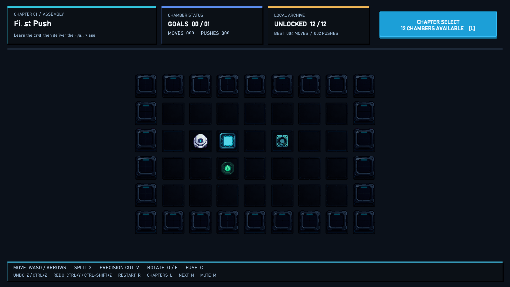

# Compound Box

一款使用 Unity 2022.3 LTS 开发的 2D 网格解谜作品集 Demo。核心机制是 **复合实体、拆分、双向网格传送门、精确切割、旋转和同材质重组**：玩家不只推动一个箱子，而是在不同阶段主动改变物体的形状、位置和组合方式。




## 当前内容

- 12 个经过自动化解法验证的关卡
- 4 个章节、主界面和章节选择
- 多格复合实体与确定性推挤链
- 逐格材质和实体内部连接图
- 拆分、精确切割和相邻同材质重组
- 不规则复合体的形状保持移动和旋转
- 双向传送门与可移动传送节点
- 复合目标、出口和关卡完成判定
- Command + 状态快照的撤销、重做和标准解回放
- 逻辑层、应用层和表现层分离
- ScriptableObject 关卡、Catalog 和美术主题
- New Input System 键鼠与手柄输入
- JSON 本地存档、解锁进度和最佳成绩
- 对象池复用动态实体和预览对象
- Foundry 主题素材、Kenney CC0 UI 音效和白盒备用表现
- 编辑器关卡工作台、标准解验证和 Windows 构建工具
- 35 个 EditMode 自动化测试

## 操作

| 输入 | 行为 |
| --- | --- |
| `WASD` / 方向键 / 手柄左摇杆 | 移动与推挤 |
| `X` | 拆分面前的复合实体 |
| `V` | 精确切割一条连接 |
| `C` | 重组相邻且同材质的实体 |
| `Q` / `E` | 逆时针 / 顺时针旋转 |
| `Z` / `Ctrl+Z` | 撤销 |
| `Ctrl+Y` / `Ctrl+Shift+Z` | 重做 |
| `R` | 重开关卡 |
| `N` / `Tab` / `]` | 下一关 |
| `[` | 上一关 |
| `L` | 章节选择 |
| `M` | 静音开关 |

## 运行

1. 使用 Unity `2022.3.62f3c1` 或兼容的 2022.3 LTS 打开项目。
2. 打开 `Assets/Scenes/SampleScene.unity`。
3. 进入 Play Mode。

`SampleScene` 中包含显式的 `CompoundBoxApp` 入口。运行时对象、棋盘、HUD 和音频会在启动后由代码构建。

## 工程结构

```text
Assets/Sokoban/Scripts/Core      规则、状态、实体、解析、命令和验证
Assets/Sokoban/Scripts/Runtime   应用入口、输入、棋盘表现、HUD、音效
Assets/Sokoban/Data              ScriptableObject 关卡与 Catalog
Assets/Sokoban/Editor            关卡工作台、内容构建和 Windows 构建
Assets/Sokoban/Tests/EditMode    规则、传送、机制和存档测试
Assets/Sokoban/Art               主题、AI 主题素材和 Kenney CC0 资源
Docs                             技术报告、设计文档、作品集和简历材料
```

## 测试与构建

在 Unity Test Runner 中运行 `CompoundBox.EditModeTests`，或使用：

```text
Tools > Compound Box > Validate All Levels
Tools > Compound Box > Build Windows64
```

测试覆盖：

- 12 个内置关卡的标准解可通关
- 移动阻挡和确定性推挤链
- 双向传送
- 出口在入口前方的上下传送
- 出口在入口后方的上下传送
- 不规则复合体水平、向上和向下传送
- 可移动传送节点及节点冲突
- 拆分、精确切割、重组和旋转
- 撤销、重做和历史标签
- JSON 存档序列化与进度解锁
- New Input System 动作初始化
- 可移动传送节点视觉标识
- 对象池复用和关卡 Catalog 转换

## 文档

- [完整技术分析与求职说明](Docs/TechnicalPortfolioReport.md)
- [简历项目经历与零基础技术教学](Docs/ResumeProjectExperienceAndTechTutorial.md)
- [项目架构说明](Docs/Architecture.md)
- [游戏设计说明](Docs/GameDesign.md)
- [同类游戏与竞品调研](Docs/CompetitiveResearch.md)
- [五款重点作品的地图与机制拆解](Docs/ComparativeLevelDesign.md)
- [完整游戏开发流程](Docs/FullProductionPlan.md)
- [美术与表现层方案](Docs/ArtAndPresentationPipeline.md)
- [美术素材与版权合规](Docs/AssetCompliance.md)
- [AI 美术素材生成指南](Docs/AIAssetGenerationGuide.md)
- [S7 内容审查](Docs/ContentAudit.md)
- [作品集展示指南](Docs/PortfolioGuide.md)
- [Third Party Notices](ThirdPartyNotices.md)

## 设计参考

项目参考了经典 Sokoban 的规则可读性、Baba Is You 的涌现式组合、Patrick's Parabox 的空间递归表达、A Monster's Expedition 的温和教学，以及 Sokobond 对“组合/分子”主题的处理。参考集中在机制研究和教学节奏，没有复制任何商业作品的关卡、美术或代码。

