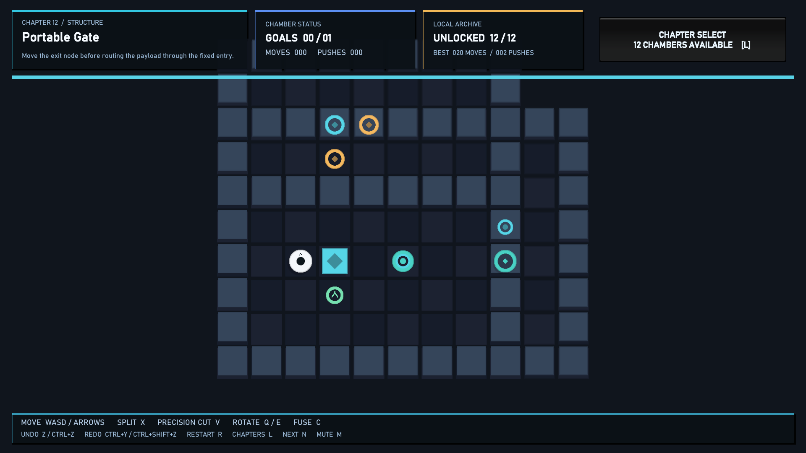
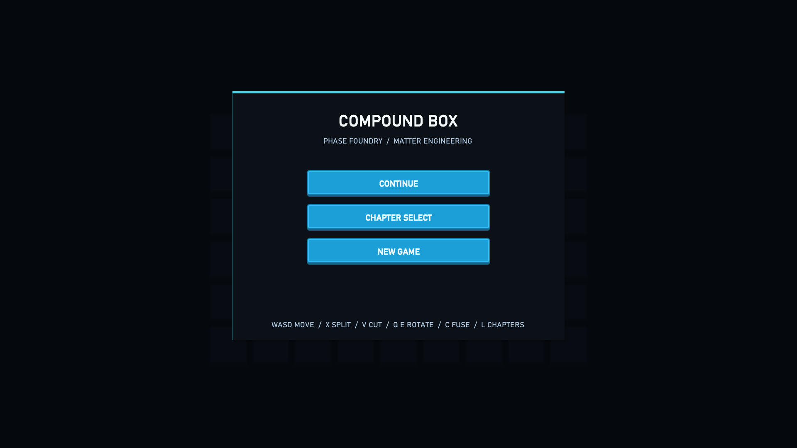

# Compound Box

一款使用 Unity 2022.3 LTS 开发的 2D 网格解谜作品集 Demo。核心机制是 **复合实体、拆分、网格传送门、同材质重组**：玩家不只推动一个箱子，而是在不同阶段主动改变物体的形状、位置和组合方式。





## 当前内容

- 12 个经过自动化解法验证的关卡
- 多格复合实体与经典推箱子推挤规则
- 面对朝向物件的拆分操作
- 相邻同材质实体的重组
- 逐格材质混合实体
- 精确切割与连接端点保留
- 复合体顺时针/逆时针旋转
- 可移动传送节点
- 支持多格实体的锚点式网格传送门
- 目标坑、复合目标、出口和关卡完成判定
- 撤销、重做、重开、关卡循环切换
- Command 模式动作历史与双栈撤销/重做
- 玩家、关卡流程和机关状态机的通用 FSM
- ScriptableObject 关卡配置与默认 Catalog
- JSON 本地存档、关卡解锁和最佳步数记录
- 实体表现对象池，降低频繁拆分/重组产生的 GC
- 程序化白盒视觉和程序化音效，无外部素材依赖
- 编辑器关卡工作台与一键解法校验
- 20 个 EditMode 自动化测试

## 操作

| 输入 | 行为 |
| --- | --- |
| `WASD` / 方向键 | 移动与推挤 |
| `X` | 拆分面前的复合实体 |
| `C` | 重组所有相邻且同材质的实体 |
| `Ctrl+Z` | 撤销 |
| `Ctrl+Y` / `Ctrl+Shift+Z` | 重做 |
| `R` | 重开关卡 |
| `N` / `Tab` / `]` | 下一关 |
| `[` | 上一关 |
| `M` | 静音开关 |

## 运行

1. 使用 Unity `2022.3.62f3c1` 或兼容的 2022.3 LTS 打开项目。
2. 打开 `Assets/Scenes/SampleScene.unity`。
3. 进入 Play Mode。

`SampleScene` 中包含显式的 `CompoundBoxApp` 入口。运行时对象、棋盘、HUD 和音频会在启动后由代码构建。

## 工程结构

```text
Assets/Sokoban/Scripts/Core      纯规则与状态模拟
Assets/Sokoban/Scripts/Runtime   应用入口、棋盘表现、HUD、音效
Assets/Sokoban/Data              ScriptableObject 关卡与 Catalog
Assets/Sokoban/Editor            关卡工作台与验证工具
Assets/Sokoban/Tests/EditMode    规则与关卡测试
Docs                             游戏设计、技术设计和作品集说明
```

## 测试

在 Unity Test Runner 中运行 `CompoundBox.EditModeTests`，或在编辑器中打开：

`Tools > Compound Box > Validate All Levels`

测试覆盖：

- 所有内置关卡的记录解法都能通关
- 墙体阻挡不会推进计数
- 拆分与重组保持材质和格子数据
- 传送门保持复合体形状与锚点
- 撤销和重做恢复精确状态
- Command 历史标签与双栈行为
- FSM 状态迁移
- JSON 存档序列化
- ScriptableObject 关卡转换
- 对象池复用
- 混合材质解析与移动
- 精确切割连接图
- 旋转占用验证
- 可移动传送节点标准解
- 自动关卡审查与难度指标
- 已解锁章节选择界面

## 设计与技术文档

- [游戏设计说明](Docs/GameDesign.md)
- [同类游戏与竞品调研](Docs/CompetitiveResearch.md)
- [五款重点作品的地图与机制拆解](Docs/ComparativeLevelDesign.md)
- [可执行升级计划](Docs/UpgradePlan.md)
- [完整开发执行计划](Docs/ProductionPlan.md)
- [项目完整实现说明](Docs/ImplementationDeepDive.md)
- [项目架构说明](Docs/Architecture.md)
- [完整游戏开发流程](Docs/FullProductionPlan.md)
- [美术素材与版权合规](Docs/AssetCompliance.md)
- [Third Party Notices](ThirdPartyNotices.md)
- [S7 内容审查](Docs/ContentAudit.md)
- [技术设计说明](Docs/TechnicalDesign.md)
- [作品集展示指南](Docs/PortfolioGuide.md)

## 设计参考

项目参考了经典 Sokoban 的规则可读性、Baba Is You 的涌现式组合、Patrick's Parabox 的空间递归表达、A Monster's Expedition 的温和教学，以及 Sokobond 对“组合/分子”主题的处理。参考集中在机制研究和教学节奏，没有复制任何商业作品的关卡、美术或代码。
